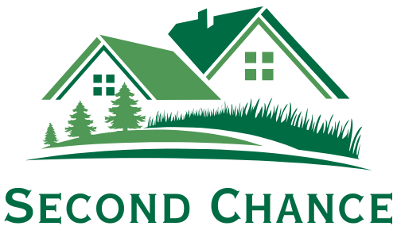

<h1 align="center">
  <a href="https://github.com/CSC-648-SFSU/CSC648-01-FA24-Team05" target="_blank">
    
  </a>
  <br>
  <br>
  SecondChance: The Eco-Friendly Rental Platform
</h3>


<!-- vscode-markdown-toc -->
* 1. [Introduction](#Introduction)
* 2. [Key Features](#KeyFeatures)
* 3. [Technologies Used](#TechnologiesUsed)
* 4. [Updated Page Names](#UpdatedPageNames)
* 5. [Team 05 Members](#Team05Members)
* 6. [Setup](#Setup)
* 7. [Setup Backend](#SetupBackend)
* 8. [Setup Frontend](#SetupFrontend)
* 9. [Git Commands](#GitCommands)
* 10. [Resources](#Resources)
* 11. [Testing and Building Docs](#TestingandBuildingDocs)
	* 11.1. [Run Tests](#RunTests)
	* 11.2. [Build Documentation](#BuildDocumentation)

<!-- vscode-markdown-toc-config
	numbering=true
	autoSave=true
	/vscode-markdown-toc-config -->
<!-- /vscode-markdown-toc -->

##  1. <a name='Introduction'></a>Introduction

In today's fast-paced, consumer-driven world, waste and overproduction are growing concerns. Our project for CSC 648 focuses on combating these ecological challenges by creating **SecondChance**, a platform for renting second-hand items. This website offers users a chance to rent and lease a variety of pre-owned products, promoting sustainability and reducing waste.

Key technologies include Django, Django Rest Framework, and Next.js, along with Tailwind CSS for responsive design. Real-time chat functionality powered by sockets enhances user interactions.

### Quick Demo

<p align="center">
  
</p>

##  2. <a name='KeyFeatures'></a>Key Features

| **Feature**                     | **Description**                                                                                         |
| ------------------------------- | ------------------------------------------------------------------------------------------------------- |
| **Eco-Conscious Rentals**       | Focus on renting second-hand items, reducing waste and promoting sustainability.                        |
| **User-Friendly Listings**      | Users can easily add, browse, and manage listings of second-hand items.                                 |
| **Real-Time Communication**     | Integrated real-time chat feature allows renters and sellers to discuss terms and conditions.           |
| **Search and Filters**          | Advanced search and filter options to find items based on location, category, price, and condition.     |
| **Favorites List**              | Users can save favorite items to rent in the future.                                                    |
| **Secure Transactions**         | Payment gateways to ensure safe and secure rental transactions.                                         |
| **Sustainability Tips**         | A dedicated page offering eco-friendly tips on how to reuse, recycle, and maintain items.               |
| **Personalized User Dashboard** | Renters and sellers have personalized dashboards to manage their rentals, listings, and communications. |
| **Responsive Design**           | The platform is fully responsive and works seamlessly on all devices.                                   |

##  3. <a name='TechnologiesUsed'></a>Technologies Used

|       **Technology**        |           **Usage**           |
| :-------------------------: | :---------------------------: |
|        **Frontend**         |     Next.js, Tailwind CSS     |
|    **Web App Framework**    | Django, Django Rest Framework |
|         **Backend**         |            Python             |
|        **Database**         |          PostgreSQL           |
|     **Authentication**      |        Django Allauth         |
|   **Search and Filters**    |         Elasticsearch         |
|       **Web server**        |             nginx             |
|       **Deployment**        |        Docker, AWS EC2        |
|     **Version Control**     |            GitHub             |
|      **Compiler/IDE**       |            VS Code            |
| **Real-Time Communication** |          WebSockets           |

##  4. <a name='UpdatedPageNames'></a>Updated Page Names

- **Homepage:** Welcome and feature overview of available second-hand items for rent.
- **User Dashboard:** Personalized page where users can manage their rentals, preferences, and communication.
- **Item Listing:** A page to add new second-hand items for rent, showcasing details, conditions, and rental rates.
- **Detail Page:** In-depth view of each item’s features, rental price, availability, and reviews from other users.
- **My Rentals:** Manage the user’s current and previous rental engagements.
- **My Listings:** A page for sellers/users to manage the items they have listed for rent.
- **Favorites:** A section for users to save and manage their favorite items to rent.
- **Chat Page:** Real-time chat for communication between renters and sellers to discuss rental terms, conditions, and other inquiries.
- **Search & Filters:** A sophisticated search mechanism allowing users to filter second-hand items based on price, category, location, and condition.
- **Sustainability Tips Page:** A dedicated page offering users ecological tips on reusing and maintaining items to further reduce environmental waste.

##  5. <a name='Team05Members'></a>Team 05 Members

| **Student Name** |     **Student Email**      | **GitHub Username** | **Student's Role**  |
| :--------------: | :------------------------: | :-----------------: | :-----------------: |
|   Parth Desai    |      pdesai@sfsu.edu       |     pycoder2000     |   Team Lead / PM    |
|   Pedro Grande   |   pgrande@mail.sfsu.edu    |      PFGrande       | Front-end Developer |
|  Charvi Sharma   |      csharma@sfsu.edu      |  charvisharma6732   |    Scrum Master     |
| Josue Hernandez  | jhernandez53@mail.sfsu.edu |    johernandez26    |     Git Master      |
|  Andre Velarde   |     nvelarde@sfsu.edu      |     NathVelarde     |    Back-end Lead    |
|  Preet Vithani   |     pvithani@sfsu.edu      |       preet56       |   Front-end Lead    |
|  Hsin-Ying Tsai  |      htsai1@sfsu.edu       |     Golden1018      | Back-end Developer  |

##  6. <a name='Setup'></a>Setup

1. Clone the project repository
```bash
git clone git@github.com:CSC-648-SFSU/CSC648-01-FA24-Team05.git
```

2. Move to the project root folder.
```bash
cd application/backend/secondchance_backend
```

3. Create and activate a virtual environment.
- (For Mac)
```bash
virtualenv venv
source venv/bin/activate
```
- (For Windows)
```bash
virtualenv venv
.\venv\activate
```

4. To deactivate the environment
```bash
deactivate
```

##  7. <a name='SetupBackend'></a>Setup Backend

Follow the steps mentioned under the **Setup Backend** section in the instructions provided earlier.

##  8. <a name='SetupFrontend'></a>Setup Frontend

Follow the steps mentioned under the **Setup Frontend** section in the instructions provided earlier.

##  9. <a name='GitCommands'></a>Git Commands

Follow the Git commands provided earlier in the instructions to manage your branches and updates.

##  10. <a name='Resources'></a>Resources

- [How to setup Github SSH](https://www.theserverside.com/blog/Coffee-Talk-Java-News-Stories-and-Opinions/GitHub-SSH-Key-Setup-Config-Ubuntu-Linux)
- [How to setup a Django Project](https://medium.com/@hacodder/setting-up-a-django-project-a-step-by-step-guide-a60dad87e82a) (:warning: Only uptil Step 2)

##  11. <a name='TestingandBuildingDocs'></a>Testing and Building Docs

###  11.1. <a name='RunTests'></a>Run Tests
To run the tests with coverage:
```bash
docker exec -it backend-web-1 pytest
```

###  11.2. <a name='BuildDocumentation'></a>Build Documentation
1. Navigate to the docs folder:
```bash
cd application/backend/secondchance_backend/docs
```

2. Clean previous builds and build the documentation:
```bash
make clean
make html
```